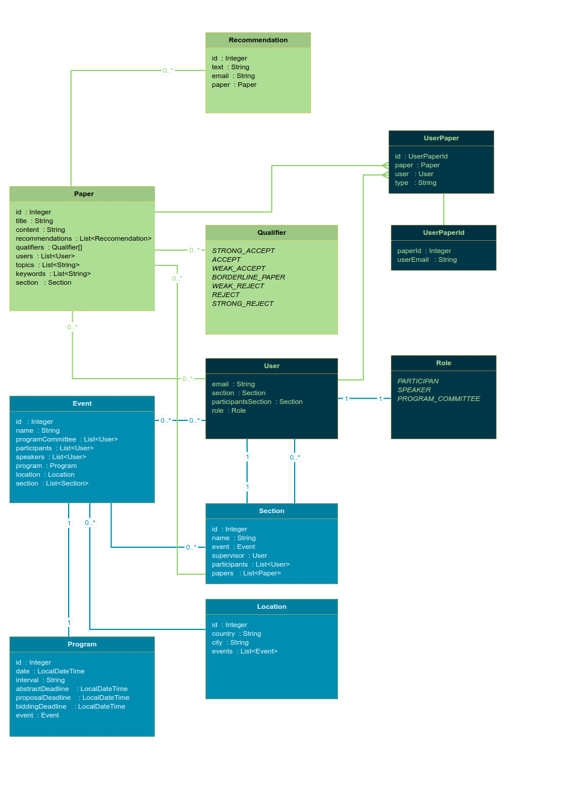
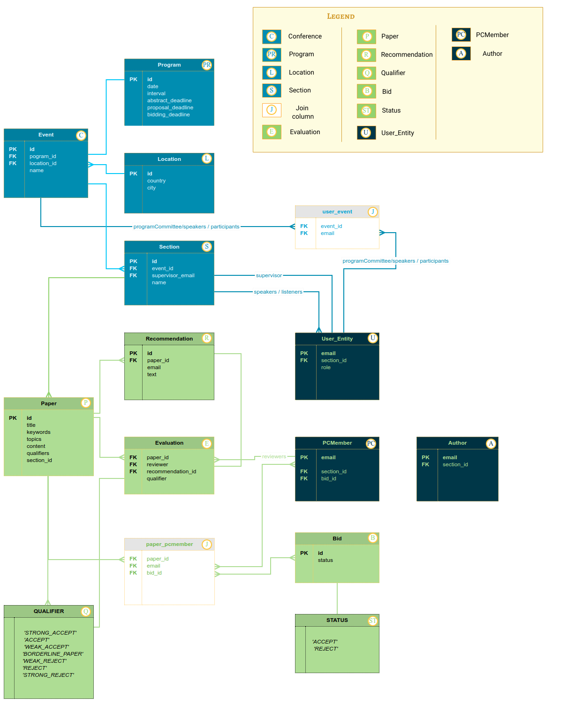

# Conference-management-system

In this project we will show how spring data jpa can be used to integrate with postgresql. 

### 🌀 Build and run
Build the application by running clean command followed by install from the maven tool window or run the following command from terminal : `mvn clea install` .
Now you can start the application by running Server class in your IDE or by running :
`java -jar uber-conference-management-system-1.0-SNAPSHOT.jar`

### ❄ Project structure
We have twelve entities and two enums. Here is the class diagram that contain relations between them:


### 💎 Database schema

```postgres-psql
create table if not exists event 
(
	id smallint NOT NULL GENERATED ALWAYS AS IDENTITY primary key,
	name text,
	program_id smallint,
	location_id smallint 
);

create table if not exists location
(
	id smallint NOT NULL GENERATED ALWAYS AS IDENTITY primary key,
	country text,
	city text
);

create table if not exists paper
(
	id smallint NOT NULL GENERATED ALWAYS AS IDENTITY primary key,
	title text,
	content text,
	qualifiers text[],
	topics text[],
	keywords text[],
    section_id smallint
);

create table if not exists program 
(
	id smallint NOT NULL GENERATED ALWAYS AS IDENTITY primary key,
	date DATE,
	interval text,
	abstract_deadline DATE,
	proposal_deadline DATE,
	bidding_deadline DATE
);

create table if not exists recommendation
(
	id smallint NOT NULL GENERATED ALWAYS AS IDENTITY primary key,
	text text
);

create table if not exists section
(
	id smallint NOT NULL GENERATED ALWAYS AS IDENTITY primary key,
	name text,
	event_id smallint,
	supervisor_email text
);

create table if not exists user_entity
(
	email text NOT NULL primary key,
	section_id smallint
);

create table if not exists user_event
(
	email text,
	event_id smallint
);

create table if not exists evaluation
(
    paper_id smallint,
    recommendation_id smallint,
    reviewer text,
    qualifier text
);

create table if not exists pc_member
(
	email text NOT NULL primary key,
	section_id smallint,
        bid_id smallint
);

create table if not exists author
(
	email text NOT NULL primary key,
	section_id smallint
);

create table if not exists bid 
(
	id smallint NOT NULL GENERATED ALWAYS AS IDENTITY primary key,
	status text
);
create table if not exists paper_pcmember 
(
	paper_id smallint,
	bid_id smallint,
        email text
);
ALTER TABLE paper_pcmember 
ADD FOREIGN KEY (paper_id) REFERENCES paper(id);

ALTER TABLE paper_pcmember 
ADD FOREIGN KEY (bid_id) REFERENCES bid(id);

ALTER TABLE paper_pcmember 
ADD FOREIGN KEY (email) REFERENCES pc_member(email);

ALTER TABLE evaluation 
ADD FOREIGN KEY (paper_id) REFERENCES paper(id);

ALTER TABLE evaluation 
ADD FOREIGN KEY (recommendation_id) REFERENCES recommendation(id);

ALTER TABLE evaluation 
ADD FOREIGN KEY (reviewer) REFERENCES pc_member(email);

CREATE TYPE qualifier AS ENUM
    ('WEAK_REJECT', 'WEAK_ACCEPT', 'STRONG_ACCEPT', 'REJECT', 'BORDERLINE_PAPER', 'ACCEPT', 'STRONG_REJECT');

ALTER TABLE event 
ADD FOREIGN KEY (location_id) REFERENCES location(id);

ALTER TABLE event 
ADD FOREIGN KEY (program_id) REFERENCES program(id);

ALTER TABLE section
ADD FOREIGN KEY (event_id) REFERENCES event(id);

ALTER TABLE section
ADD FOREIGN KEY (supervisor_email) REFERENCES pc_member(email);

ALTER TABLE section
ADD CONSTRAINT supervisor_unique UNIQUE(supervisor_email);

ALTER TABLE user_entity
ADD FOREIGN KEY (section_id) REFERENCES section(id);

ALTER TABLE user_event
ADD FOREIGN KEY (event_id) REFERENCES event(id);

ALTER TABLE user_event
ADD FOREIGN KEY (email) REFERENCES user_entity(email);

ALTER TABLE paper 
ADD FOREIGN KEY (section_id) REFERENCES section(id);
```

##### Database tables:



### 🚀 Use Postman to test the REST apis
There are 4 main request URLs, depending on which controller is responsible to handle the request : 

- `http://localhost:8080/api/conference` for `ConferenceManagementController.class`
- `http://localhost:8080/api/paper` for `PaperController.class`
- `http://localhost:8080/api/programCommittee` for `ProgramCommitteeController.class`
- `http://localhost:8080/api/user` for `UserController.class`

The `ConferenceManagementController.class` is used to handle requests for conference information, like adding an event, a program, a location and multiple sections for a certain event. Also we can update event's program, postpone date for program, get all events or sections.

The `PaperController.class` is used to handle requests regarding papers. We can submit a paper, update papers's content, get all papers.

The `ProgramCommitteeController.class` contain requests that are used to organize the participants. For example we can update users role, assign paper to a user, review a paper, update supervisor for specific section, add recommendation for a paper.

The `UserController.class` is used to manage users actions: register, bid proposal if the user want to write a review for that paper. Also we can update the section in which the user wants to participate.
